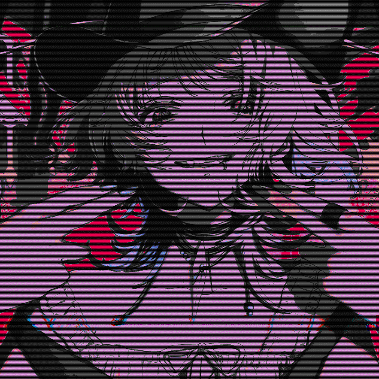

input:


cmd:

you can apply any arbitrary set of colors to an image, in this case I used a theme file for the Kitty terminal.
`pixxy` will automatically parse this file for any valid hex colors and apply them to the image. You can use
any file (or string) that contains hex colors. This can be useful for creating themed wallpapers, you could pick
any Gruvbox config file and the image will match those colors.

```sh
pixxy glitch --input ~/Pictures/cowgirl-thumbnail.jpg --output output.gif --seed sweet -t 1.0 --palette-file ~/.config/kitty/themes/ayanami-cold.conf --gif -v
```

output:

